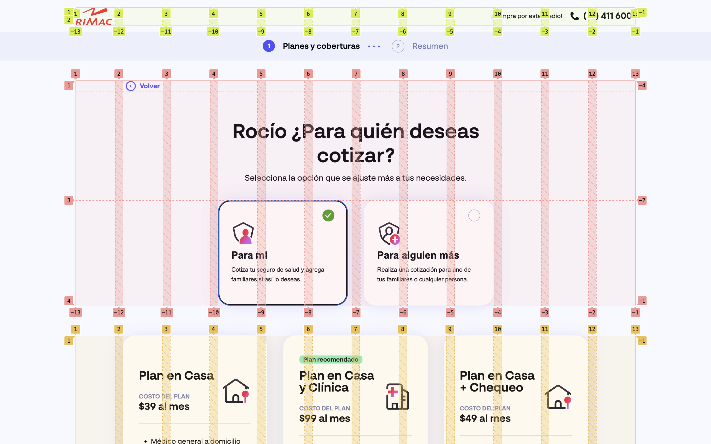

# Rimac Frontend Challenge

## Recursos

- Figma: https://www.figma.com/file/KGftIKxhcVm41kTKMsfTh2/Frontend-Challenge-2023
- APIs:
  - user: https://rimac-front-end-challenge.netlify.app/api/user.json
  - plans: https://rimac-front-end-challenge.netlify.app/api/plans.json

## Sustentación

El Stack utilizado es el siguiente: React (Vite), TypeScript y Sass (scss) con metodología BEM. Para experiencia de desarrollo se configuró ESLint y Prettier.

Nota: Personalmente prefiero un approach entre SSG y SPA, sin embargo, por motivos de prueba SPA fue suficiente.

### Arquitectura del proyecto:

- `src/assets`: Contiene los estilos, imágenes, iconos y fuentes.
- `src/components`: Contiene los componentes de la aplicación con **dominio global**.
- `src/hooks`: Contiene los hooks de **dominio global**.
- `src/routes`: Contiene las rutas de la aplicación.
  - Dado que la complejidad de la aplicación no lo requería, el enrutamiento es manual en el archivo `src/router.tsx`. Esto permite añadir un router con facilidad en el futuro.
  - Se identifica a las rutas con el nombre `routes/.../page.tsx`.
  - Cada ruta contiene sus componentes de **dominio específico**.
- `src/services`: Contiene los servicios para obtener los datos del endpoint ofrecido. Se construyeron 2 servicios para obtener los datos de usuario y planes, los cuales se consumen en los componentes correspondientes.
  - Cada servicio contiene su colección, modelo (types) y mapper.
- `src/store`: Contiene el contexto de la aplicación.
  - Se utilizó el React Context API para manejar el estado global de la aplicación.
  - Persistencia: Se utilizó `localStorage` para la persistencia del `store`. Por motivos de prueba, solo se consideró para los datos del usuario.
- `src/types`: Contiene los tipos de datos utilizados en la aplicación.
- `src/utils`: Contiene utilidades para la aplicación.

### Rendimiento y optimización:

- Se utilizó el hook `useMemo` en los componentes que realizaban cálculos pesados.
- Con un router se podría implementar `React.lazy` y `Suspense` para la carga de componentes de manera dinámica.

### Estilos:

- Grid system: Se consideraron las grillas en una utilidad llamada `.grid-page`, ubicada en `src/assets/scss/utils.scss`.

|                   Grid Screen                   |                      Grid Screen Mobile                       |
| :---------------------------------------------: | :-----------------------------------------------------------: |
|  |  |

- Responsive: Dado que no hubo diseños para viewport de tablet, no se visualizan bien algunos elementos en esa vista.
- Tokens: Al no estar especificados, se complicó el uso de tokens. No se pudo crear un token para todas las propiedades en el diseño. El caso ideal es mantener una lista de tokens entre desarrollo y diseño.
- Units: Es recomendado trabajar con REM o EM, sin embargo, se dejó en PX ya que así se encontró por defecto en el diseño.
- Fonts: No pude encontrar las fuentes del diseño, pero se usó una similar con 3 niveles de fuentes: normal (400), semibold (600) y bold (700).

### Validación

- Para la validación de formularios se utilizó estándares web.
  - Ejemplo: Para el teléfono se utilizó los atributos `required`, `pattern="[+0-9]*"` y `type="tel"`.
    Flujo de datos y manejo de estados:

### Pruebas

- Se utilizó `vitest` y `happy-dom` para las pruebas unitarias.
- Se realizaron pruebas en algunos componentes, utilidades y servicios en los archivo:
  - `src/routes/user-data-page/user-data-form/index.test.tsx`
  - `src/services/user-service/index.test.tsx`
  - `src/utils/dates.test.ts`

### Despliegue

- Netlify: Se utilizó para el despliegue de la aplicación.

### Observaciones

- Step 2: En el diseño del paso 2 se muestra la barra de progreso en Desktop, pero no en Mobile. Se decidió mostrarla en ambas vistas para mantener la consistencia.
